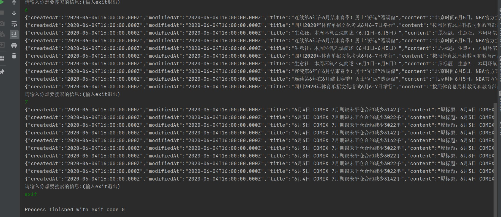

# 多线程爬虫和ES原始搜索引擎
  本项目基于java语言实现，主要以[新浪新闻](https://sina.cn)作为初始网址，爬取对应的新浪新闻存储到数据库中，
并初步使用ES搭建搜索引擎,到达通过输入你想要的信息，找到对应的新浪新闻信息的效果。(目前只有命令行界面，待后续开发网页版)


## Feature
+ 可以爬取所有以`sina.cn`为后缀的所有新闻信息
+ 提供两种数据库选择,MySQL数据库或者H2数据库(后者只适合少量数据用于测试)
+ 提供原生JDBC与Mybatis的实现
+ 可以断点爬取，数据库保留上次未爬完的link
+ 开启多线程爬取,提高爬取效率
+ 提供在MySQL数据库中快速生成百万级别的模拟数据代码，可用于学习索引优化
+ 提供在ES上生成千万级别的模拟数据，用于学习ES

## Preview




## Requirements
+ jdk1.8
+ MySQL5.7+
+ ElasticSearch7+
+ idea

## Installation
前提，Requirements都已经安装好了(默认使用MySQL及Mybatis，如需使用H2及JDBC请阅读代码自行配置)

+ 复制代码 
 ```
 git clone https://github.com/kongmu373/crawel-demo.git
```
+ 在MySQL数据库中创建news数据库
```sql
CREATE DATABASE news CHARACTER SET utf8mb4 COLLATE utf8mb4_unicode_ci;
```
+ 用idea打开该项目,修改数据源配置
  - 修改[pom.xml](https://github.com/kongmu373/crawel-demo/blob/master/pom.xml) 文件
    ```xml
       ...
       <!-- 修改对应的url,user,password    -->
       <plugin>
           <groupId>org.flywaydb</groupId>
           <artifactId>flyway-maven-plugin</artifactId>
           <version>5.2.4</version>
           <configuration>
               <url>jdbc:mysql://localhost/news?useUnicode=true&amp;characterEncoding=UTF-8&amp;useSSL=false</url>
               <user>root</user>
               <password>123</password>
           </configuration>
       </plugin>
       ...
    ```
  - 修改[mybatis-config.xml](https://github.com/kongmu373/crawel-demo/blob/master/src/main/resources/db/mybatis/mybatis-config.xml) 文件
    ```xml
    ...
    <!-- 对应的url,username, password -->   
    <environment id="development">
        <transactionManager type="JDBC"/>
        <dataSource type="POOLED">
            <property name="driver" value="com.mysql.jdbc.Driver"/>
            <property name="url" value="jdbc:mysql://localhost/news?characterEncoding=UTF-8&amp;useSSL=false"/>
            <property name="username" value="root"/>
            <property name="password" value="123"/>
        </dataSource>
    </environment>
    ...
    ```
+ 命令行执行
 ```
mvn flyway:clean&&mvn flyway:migrate
 ```
+ 用idea打开 [Main.java](https://github.com/kongmu373/crawel-demo/blob/master/src/main/java/com/github/kongmu373/Main.java) 文件，并执行其中的main方法
就开启多线程爬虫了，数据保存在news数据库的NEWS表中.
+ 运行[CopyDataToES.java](https://github.com/kongmu373/crawel-demo/blob/master/src/main/java/com/github/kongmu373/CopyDataToES.java) 文件中的main方法
将数据复制到ES中
+ 运行[ElasticsearchEngine.java](https://github.com/kongmu373/crawel-demo/blob/master/src/main/java/com/github/kongmu373/ElasticsearchEngine.java) 文件中的main方法即打开搜索的命令行客户端
+ 其他(模拟数据):
    + 将MySQL数据库中的数据模拟到百万级别 运行[MockMySQLDataGenerator.java](https://github.com/kongmu373/crawel-demo/blob/master/src/main/java/com/github/kongmu373/MockMySQLDataGenerator.java) 中的main方法
    + 将ES中的数据模拟到千万或亿级别 运行[MockElasticsearchDataGenerator.java](https://github.com/kongmu373/crawel-demo/blob/master/src/main/java/com/github/kongmu373/MockElasticsearchDataGenerator.java) 文件中的main方法

 


